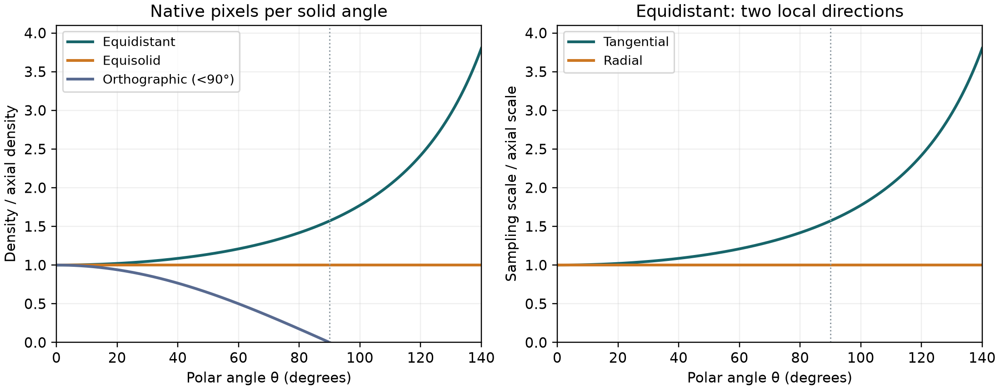

# 教材 A：魚眼影像的立體角取樣密度
# Teaching Note A: Solid-Angle Sampling in Fisheye Images

課堂講義 / Classroom handout · 2026-09-29 · 逐段中英對照 / Paragraph-paired Chinese and English

**中。** 本講義依本次討論重組，目標是分清「CMOS 上的像素」、「每單位立體角的取樣」、「實際可辨識細節」與「重投影後的輸出像素」。先讀第 1–5 節建立概念，再讀第 6–10 節的球面編碼與鏡頭比較；第 11 節可作課堂問答，第 12 節提供延伸活動。公式推導與數值例子是教學分析，不是新鏡頭實測。使用者描述的博士論文儀器與兩階段呈現方法尚未由本次工作獨立驗證。

**EN.** This handout reorganizes the session to distinguish sensor pixels, samples per solid angle, actual resolvable detail, and output pixels after reprojection. Read sections 1–5 for foundations and sections 6–10 for spherical encoding and lens comparisons. Section 11 provides classroom questions; section 12 offers extensions. Derivations and numerical examples are instructional analyses, not new lens measurements. The user's described doctoral apparatus and two-stage rendering method have not been independently verified here.

## 1. 三種「密度」與一種「解析力」 / Three densities and resolving power

**中。** CMOS 像素密度是每平方毫米有多少感光格子；幾何角取樣密度是每一小塊觀看方向佔多少原始像素；輸出影像密度則由全景圖或透視圖的輸出尺寸決定。三者不同。本文以「有效」指對任務有用且通過品質檢驗，並不把它定義成單靠幾何就能算出的通用數值。實際解析力還取決於光學模糊、雜訊、校正與重取樣。相關光學閱讀見 [A3](#ref-a3)。

**EN.** CMOS density counts sensor cells per square millimetre; geometric angular sampling density counts native pixels allocated to a small region of viewing directions; output-image density depends on the chosen panorama or perspective raster. These are different. Here, “effective” means useful for a task and supported by quality evaluation, not a universal quantity determined by geometry alone. Actual resolving power also depends on optical blur, noise, calibration and resampling. See [A3](#ref-a3) for optical background.

| 符號 / Symbol | 意義 / Meaning | 單位或約定 / Unit or convention |
|---|---|---|
| θ, φ | 光軸極角、方位角 / Polar angle, azimuth | 公式用弧度 / Radians in formulas |
| ρ, F | 影像半徑、投射尺度 / Image radius, projection scale | 本文採 mm / Millimetres here |
| p, Aₚ | 方形像素邊長、面積 / Square-pixel pitch, area | Aₚ=p² |
| Ω, R | 立體角、表示球半徑 / Solid angle, representation-sphere radius | sr；R 與鏡頭尺度 F 不同 / R differs from F |
| D | 每單位立體角原始像素數 / Native pixels per solid angle | pixels/sr |
| sᵣ, sₜ | 徑向、切向角取樣尺度 / Radial, tangential angular sampling scales | pixels/radian |

**中。** 完整圓形視野是最大極角的兩倍，但只有旋轉對稱、以光軸為中心的圓形覆蓋才能如此描述。220° 完整視野對應 θmax=110°；球面赤道是 θ=90°，不是 θ=180°。角度換成弧度的方法為 θrad=θdeg×π/180；π 約為 3.14159。例如 90°=π/2。方位角 φ 的 360° 環繞與完整直徑視野不是同一概念。

**EN.** Full circular field of view is twice the maximum polar angle only for rotationally symmetric coverage centered on the optical axis. A 220° full field has θmax=110°; the spherical equator is θ=90°, not 180°. Convert degrees to radians using θrad=θdeg×π/180, with π approximately 3.14159; thus 90°=π/2. A 360° sweep in azimuth φ is different from the full diameter field of view.

## 2. 立體角是甚麼？ / What is solid angle?

**中。** 平面角用圓弧長除以圓半徑；立體角則用球面區域面積除以球半徑的平方。將同一束方向投到較大的球上，面積增加，但立體角不變。下式的 S 是球面區域面積，R 是球半徑；sr 是立體角單位 steradian。整顆球的面積是 4πR²，所以整個方向空間是 4π sr。

**EN.** A plane angle is arc length divided by circle radius; solid angle is spherical area divided by squared sphere radius. Mapping the same directions onto a larger sphere increases their area but not their solid angle. In the equation below, S is spherical area and R is sphere radius; sr denotes steradians. Since a full sphere has area 4πR², all directions occupy 4π sr.

$$
\Omega=\frac{S}{R^2},\qquad d\Omega=\sin\theta\,d\theta\,d\phi\qquad\mathrm{(A1)}
$$

**中。** 符號 d 表示「非常小的變化」。式 A1 可把一小塊球面看成窄長矩形：南北方向長度約 R dθ，東西方向長度約 R sinθ dφ；相乘再除以 R²，便得到 sinθ dθ dφ。靠近光軸時緯圈縮小，所以同樣的 dφ 不代表同樣長的球面弧。這也是均勻角度網格不等面積的原因。

**EN.** The symbol d denotes a very small change. Approximate a small spherical patch as a narrow rectangle: its north–south length is R dθ, and its east–west length is R sinθ dφ. Multiplying and dividing by R² gives sinθ dθ dφ. Latitude circles shrink near the polar axis, so the same dφ does not represent the same spherical arc length. This explains why a uniform angular grid is not equal-area.

## 3. 從面積推導像素密度 / Deriving pixel density from area

**中。** 假設投射旋轉對稱，影像半徑 ρ 隨 θ 平滑且嚴格增加。影像中的小扇形面積為 ρ dρ dφ。ρ′(θ) 讀作「ρ 對 θ 的導數」，就是角度小幅增加時，半徑增加的速率；局部近似為 dρ=ρ′dθ。下式先算面積，再除以每格像素面積 Aₚ，得到像素數 dN，最後除以立體角。

**EN.** Assume a rotationally symmetric projection whose image radius increases smoothly and strictly with θ. A small image-sector area is ρ dρ dφ. The derivative ρ′(θ) is the rate at which radius changes with angle, so locally dρ=ρ′dθ. The following equations first compute area, divide by pixel area Aₚ to obtain pixel count dN, and then divide by solid angle.

$$
dA=\rho\rho'\,d\theta\,d\phi,\qquad dN=\frac{dA}{A_p}\qquad\mathrm{(A2)}
$$

$$
D(\theta)=\frac{dN}{d\Omega}=\frac{\rho(\theta)\rho'(\theta)}{A_p\sin\theta}\qquad\mathrm{(A3)}
$$

**中。** 式 A3 衡量幾何取樣，不是光學解析力。θ=0 時直接代入會出現 0/0，應使用接近零的極限；對 ρ≈Fθ 的模型，軸心密度為 D₀=F²/Aₚ。公式須限於有效、局部可逆的視域；遮罩以外、裁切邊界及真正折返的映射不能照常使用。若有非旋轉對稱畸變，可用第 8 節的實測光線公式。

**EN.** Equation A3 measures geometric sampling, not optical resolving power. Direct substitution at θ=0 gives 0/0, so use the limiting value; when ρ≈Fθ, axial density is D₀=F²/Aₚ. Restrict the formula to a valid, locally invertible domain. Masked regions, cropped boundaries and genuinely folded mappings require separate handling. For asymmetric distortion, use the measured-ray formulation in section 8.

## 4. 等距投射：向外增加的是甚麼？ / Equidistant projection: what increases outward?

**中。** 等距投射定義為 ρ=Fθ，也就是相同的極角增量得到相同的徑向像素增量。代入式 A3，得到式 A4。這不是所有魚眼鏡頭的通則，而是一種特定投射模型；常見投射的原始公式見 [A1](#ref-a1)。

**EN.** Equidistant projection is defined by ρ=Fθ: equal polar-angle increments produce equal radial image increments. Substitution into A3 gives A4. This is a particular projection, not a rule for all fisheye lenses. The standard projection formulas are listed in [A1](#ref-a1).

$$
D_{\rm eq}(\theta)=\frac{F^2}{A_p}\frac{\theta}{\sin\theta},\qquad \frac{D_{\rm eq}(\theta)}{D_0}=\frac{\theta}{\sin\theta}\qquad\mathrm{(A4)}
$$

**中。** 例：取 F=1 mm、p=0.005 mm，Aₚ=0.000025 mm²，軸心密度為 40,000 pixels/sr。赤道 θ=90° 時乘上 π/2，得到約 62,832 pixels/sr；θ=110° 時約 81,723 pixels/sr。這是同一相機內的位置比較，不是跨鏡頭比較；數字由理想公式計算，並非量測資料。

**EN.** Example: let F=1 mm and p=0.005 mm, so Aₚ=0.000025 mm² and axial density is 40,000 pixels/sr. At the equator, θ=90°, multiplying by π/2 gives about 62,832 pixels/sr; at 110°, about 81,723 pixels/sr. This compares positions within one camera, not different lenses. These are ideal-model calculations, not measurements.

**中。** 還必須分開兩個方向。徑向是影像中往外移動，切向是沿圓環移動。球面上的真實切向角距是 sinθ dφ，不能直接當成 dφ。式 A5 的兩個尺度表示每弧度可分配多少像素；兩者乘積等於 D，但乘積較大不代表每個方向都改善。

**EN.** Two directions must be distinguished. Radial motion moves outward in the image; tangential motion follows an image ring. Actual tangential angular distance on the sphere is sinθ dφ, not simply dφ. The two scales in A5 count pixels per radian; their product equals D, but a larger product does not mean improvement in every direction.

$$
s_r=\frac{\rho'}{p}=\frac{F}{p},\qquad s_t=\frac{\rho}{p\sin\theta}=\frac{F}{p}\frac{\theta}{\sin\theta}\qquad\mathrm{(A5)}
$$

**中。** 反過來，約一像素的角取樣間距為 1/sᵣ 或 1/sₜ。等距模型中，徑向間距固定，切向間距向外縮小。這是取樣各向異性：兩個主方向不同。有效細節還須通過模糊與雜訊的檢驗，不能把 1/s 當成保證可辨識的最小物件角度。

**EN.** Conversely, the approximate one-pixel angular sampling interval is 1/sᵣ or 1/sₜ. Under equidistant projection, radial spacing is constant while tangential spacing decreases outward. This is sampling anisotropy: the two principal directions differ. Resolvable detail must also survive blur and noise, so 1/s is not a guaranteed minimum resolvable object angle.

## 5. 其他投射並非都有相同性質 / Other projections do not all behave alike

**中。** 下表由式 A3 推導，採相同軸心尺度 F，以 D₀=F²/Aₚ 正規化。正射投射只列前半球的可逆區間。等立體角的密度固定；體視投射增加；正射投射下降。因此，「所有魚眼周邊的每立體角像素數都增加」不成立。若要求各模型填滿相同像圈且覆蓋相同視野，須先分別調整 F，不能直接比較本表的未正規化密度。

**EN.** This table follows from A3, using the same axial scale F and normalizing by D₀=F²/Aₚ. Orthographic projection is restricted to its injective front-hemisphere domain. Equisolid density is constant, stereographic density increases, and orthographic density decreases. Thus, not all fisheyes allocate more pixels per solid angle toward the edge. If models must fill the same image circle at the same field of view, adjust each F before comparing unnormalized densities.

| 模型 / Model | 半徑 ρ / Radius | D/D₀ | 範圍內趨勢 / Trend |
|---|---|---|---|
| 等距 / Equidistant | Fθ | θ/sinθ | 增加 / Increases |
| 等立體角 / Equisolid | 2F sin(θ/2) | 1 | 固定 / Constant |
| 體視 / Stereographic | 2F tan(θ/2) | 1/cos⁴(θ/2) | 增加 / Increases |
| 正射 / Orthographic | F sinθ | cosθ | θ<90° 下降 / Decreases for θ<90° |

**中。** 圖 A1：左圖比較等距、等立體角與正射的正規化密度；右圖顯示等距模型的徑向與切向取樣。所有曲線為公式計算。為保持圖軸易讀，快速增加的體視曲線未畫入，請用表中公式計算；這不是宣稱它與其他曲線相同。

**EN.** Figure A1: the left panel compares normalized equidistant, equisolid and orthographic densities; the right panel separates radial and tangential equidistant sampling. All curves are analytical. The rapidly increasing stereographic curve is omitted to keep the axis readable; calculate it from the table rather than assuming it matches another curve.

## 6. 等立體角映到地球儀：密度仍固定 / Equisolid mapping to a globe preserves area density

**中。** 對 ρ=2F sin(θ/2)，導數為 ρ′=F cos(θ/2)。利用 2sin(θ/2)cos(θ/2)=sinθ，可得 ρρ′=F²sinθ。因此 dA=F²dΩ。若將每個原始像素映到半徑 R 的球面，球面面積 dS=R²dΩ，便得到式 A6。R 是您選的呈現球大小，不是鏡頭的 F。

**EN.** For ρ=2F sin(θ/2), the derivative is ρ′=F cos(θ/2). Using 2sin(θ/2)cos(θ/2)=sinθ gives ρρ′=F²sinθ, hence dA=F²dΩ. Mapping each original pixel to a sphere of radius R gives spherical area dS=R²dΩ and equation A6. R is the selected representation-sphere size, not the lens scale F.

$$
\Delta\Omega_p=\frac{A_p}{F^2},\qquad \frac{dN}{dS}=\frac{F^2}{A_pR^2}\qquad\mathrm{(A6)}
$$

**中。** 所以，理想等立體角 CMOS 影像直接映到真正球面後，每單位球面面積的像素密度仍是常數。每個完整像素對應等面積足跡，卻不必有相同形狀或相同鄰點距離。這個性質來自投射，不是單靠 CMOS 格子均勻就能成立。有限像素可對其整個區域積分；被影像圓邊界裁切的格子另行處理。

**EN.** An ideal equisolid CMOS image mapped directly onto an actual sphere retains constant pixels per spherical area. Complete pixels have equal-area footprints, but not necessarily equal shapes or neighbor distances. This property follows from the projection, not from a uniform CMOS grid alone. Finite-pixel footprints can be integrated over their full regions; cells clipped by the image-circle boundary require separate treatment.

## 7. 球座標編碼不等於等角網格重取樣 / Spherical labels are not uniform-angle resampling

**中。** 若每個來源像素只附上自己的 (θᵢ,φᵢ)，方向與取樣數沒有改變，所以原本的立體角密度仍保留。若另建固定 Δθ、Δφ 的矩形圖，便改變輸出格子的配置。下式是格子 θ₁到θ₂、φ₁到φ₂ 的精確立體角；小格子可近似為 sinθ ΔθΔφ。符號 Δ 表示有限差量，例如 Δφ=φ₂−φ₁。

**EN.** Attaching each source pixel's own (θᵢ,φᵢ) changes neither its direction nor the sample count, so the original solid-angle distribution is retained. Creating a rectangular raster with fixed Δθ and Δφ changes the output-cell arrangement. The following is the exact solid angle of a cell bounded by θ₁,θ₂,φ₁,φ₂; small cells approximate sinθ ΔθΔφ. The symbol Δ denotes a finite difference, such as Δφ=φ₂−φ₁.

$$
\Delta\Omega=(\phi_2-\phi_1)(\cos\theta_1-\cos\theta_2)\qquad\mathrm{(A7)}
$$

**中。** 相同 Δθ、Δφ 的小格子，在 θ=10° 的面積約為赤道的 0.174 倍；每格一個像素會令當地輸出密度約高 5.76 倍。這些多出的輸出像素可能只是插值，沒有增加來源資訊。若用緯度 β=π/2−θ，面積因子寫成 cosβ，而不是 sinβ；必須先確認角度定義。

**EN.** With identical Δθ and Δφ, a small cell at θ=10° has about 0.174 times the area of an equatorial cell; assigning one pixel to each makes local output density about 5.76 times higher. Extra output pixels may merely be interpolated and do not add source information. If latitude β=π/2−θ is used, the area factor is cosβ, not sinβ; define the angle first.

$$
\mu=\cos\theta,\qquad d\Omega=|d\mu|\,d\phi\qquad\mathrm{(A8)}
$$

**中。** 式 A8 提供一種等面積編碼：使 μ 與 φ 等間距，而讓 θ 不等間距。絕對值符號表示面積取正值，因為 θ 增加時 cosθ 下降。這仍不保證格子等形狀；HEALPix 是另一種同層級格子等面積的球面分割，見 [A2](#ref-a2)。均勻角度圖適合顯示，等面積網格適合某些球面統計，兩者可依任務選用。

**EN.** Equation A8 provides equal-area encoding: use uniform μ and φ spacing while allowing nonuniform θ. Absolute value makes area positive because cosθ decreases as θ increases. Equal area still does not guarantee equal shape. HEALPix is another equal-area spherical partition at each resolution level; see [A2](#ref-a2). Uniform-angle maps can suit display, while equal-area grids can suit spherical statistics; choose according to the task.

## 8. 實測 ray of sight 與兩階段呈現 / Measured sight rays and two-stage rendering

**中。** 使用者描述的儀器可量測像素對應的視線。若得到單位方向場 n(u,v)，便可直接估計每個像素對應的立體角，而不必先指定等距或等立體角。式 A9 的偏導數表示只移動 u 或 v 時方向改變多少；叉積形成兩個方向變化張成的小面積，雙直線表示向量長度。此式為進階閱讀，初學者可先理解為「把一個像素的小方格映到球面，量它變成多大的區域」。

**EN.** The user's described apparatus measures pixel-associated sight rays. Given a unit-direction field n(u,v), pixel solid angles can be estimated without first assuming equidistant or equisolid projection. In A9, partial derivatives measure directional change when moving only u or v; the cross product measures the small area spanned by those changes, and double bars mean vector magnitude. This is optional advanced reading: beginners can interpret it as mapping a small pixel square onto the sphere and measuring its area.

$$
J_\Omega=\left\|\frac{\partial\mathbf n}{\partial u}\times\frac{\partial\mathbf n}{\partial v}\right\|,\qquad D=\frac{1}{J_\Omega}\qquad\mathrm{(A9)}
$$

**中。** 式 A9 的 u、v 以像素為單位；它適用於平滑、局部可逆的映射。方向量測雜訊會被微分放大，應使用具不確定度評估的平滑或像素足跡積分。只量方向不等於驗證所有光線共點；非中心鏡頭還需記錄光線位置。核心球體表示方向，不是物件真的位於球面上，也不能單憑球面圖恢復物距。

**EN.** Coordinates u,v in A9 are measured in pixels, and the mapping must be smooth and locally invertible. Differentiation amplifies directional measurement noise, so use uncertainty-aware smoothing or pixel-footprint integration. Direction measurements alone do not establish a common ray center; non-central lenses also require ray positions. The core sphere represents directions, not a physical object surface, and a spherical map alone does not recover range.

**中。** 「原始魚眼→核心球體→功能性地圖」可以是兩階段幾何、一階段取樣：把兩個變換合成，讓最終輸出像素反查原始影像，只插值一次。縮小時須依來源足跡做抗混疊；放大不會增加獨立細節。做輻射度平均或總量統計時，還應區分像素值代表亮度樣本還是積分量，不能僅因格子面積不同就任意乘除像素強度。

**EN.** “Raw fisheye → core sphere → functional map” can use two geometric stages but one resampling stage: compose the mappings and sample the original image directly for each output pixel. Downsampling requires footprint-aware antialiasing; upsampling adds no independent detail. For radiometric averages or totals, distinguish intensity samples from integrated quantities rather than automatically multiplying or dividing pixel values by cell area.

## 9. 220° 全景與 280° 鏡頭的比較 / Comparing a 220° panorama and a 280° lens

**中。** 220° 等距鏡頭的赤道 θ=90°，每立體角密度為光軸極限的 1.571 倍，切向取樣也是 1.571 倍，徑向仍是 1 倍。如果把本次討論的「180±40」理解成兩倍極角，環帶就是 θ=70–110°，而不是 140–220° 的極角。環繞光軸的方位角仍可遍歷 360°。和中央虛擬針孔圖比較時，應比較原始方向取樣；任意設定的輸出圖寬度不構成精度證據。

**EN.** At the equator θ=90° of a 220° equidistant lens, solid-angle density and tangential sampling are 1.571 times their axial limits, while radial sampling remains unchanged. Interpreting this session's “180±40” as doubled polar angles gives θ=70–110°, not polar angles of 140–220°. Azimuth around the optical axis may still span 360°. Compare native directional sampling with a central virtual pinhole view; arbitrary output raster widths do not establish accuracy.

**中。** 跨鏡頭比較則要固定資源。令 Rᵢ 為感光面像圈半徑，注意它不是球半徑 R。相同 CMOS、像素間距與像圈大小下，等距尺度 F=Rᵢ/θmax。式 A10 比較 280° 與 180° 理想鏡頭在共同方向的密度。平方來自密度與 F² 成比例，角度比可直接使用度數，因為轉弧度的因子會抵消。

**EN.** Cross-lens comparisons must hold resources fixed. Let Rᵢ be the sensor image-circle radius, distinct from sphere radius R. With the same CMOS, pixel pitch and image circle, equidistant scale is F=Rᵢ/θmax. Equation A10 compares ideal 280° and 180° lenses at shared directions. The square arises because density is proportional to F²; degrees may be used in this ratio because the radian-conversion factors cancel.

$$
F=\frac{R_i}{\theta_{\max}},\qquad \frac{D_{280}}{D_{180}}=\left(\frac{90}{140}\right)^2\approx0.413\qquad\mathrm{(A10)}
$$

**中。** 280° 鏡頭自身的邊緣密度約為自身軸心的 3.80 倍，同時它在共同方向的密度卻可能只有上述 180° 鏡頭的 41.3%。兩者不矛盾：一個是單鏡頭內比較，一個是固定像素預算的跨鏡頭比較。不需要後向覆蓋的任務可能不宜使用 280°；需要後向資訊的任務則可能值得付出取樣代價。不能單憑周邊密度增加就判定不適用。

**EN.** A 280° lens has approximately 3.80 times its own axial density at its edge, yet only 41.3% of the comparison 180° lens's density at shared directions under the stated constraints. These are compatible: one compares positions within a lens, the other lenses under a fixed pixel budget. A task not needing rearward coverage may avoid 280°; another may benefit enough to justify its sampling cost. Peripheral density growth alone does not establish unsuitability.

## 10. 幾何失真、光學模糊與實際效用 / Geometric distortion, optical blur and usefulness

**中。** 已知、可逆的幾何變形並不自動模糊資訊；但實際鏡頭的像差、失焦、雜訊及數位處理可能降低可辨識細節。MTF 是「調變傳遞函數」：觀察不同粗細的明暗條紋，量測其對比還保留多少。它與像素密度不是同一量。建議逐角度、逐方向量測 MTF 或邊緣響應，並以角度單位報告可辨識尺度，再與 D、sᵣ、sₜ 對照。[A3](#ref-a3) 是光學 MTF 的延伸文獻；本文不引用其未取得全文的數值結果。

**EN.** Known, invertible geometric deformation does not automatically blur information, but physical aberrations, defocus, noise and digital processing can reduce resolvable detail. MTF means modulation transfer function: it measures how much contrast remains for alternating bright/dark patterns of different fineness. It is not pixel density. Measure MTF or edge response by angle and direction, express resolving scales in angular units, and compare them with D, sᵣ and sₜ. [A3](#ref-a3) provides optical MTF reading; no numerical results from its unavailable full text are used here.

## 11. 課堂 Q&A / Classroom Q&A

### Q1. CMOS 密度均勻，球面密度就均勻嗎？ / Does uniform CMOS density imply uniform spherical density?

**中。** 不一定。還需要 dA/dΩ 固定；理想等立體角投射符合，等距投射不符合。請用式 A3 檢查投射，而不是只觀察感光格子。

**EN.** Not necessarily. The ratio dA/dΩ must also be constant. Ideal equisolid projection satisfies this; equidistant projection does not. Check A3 rather than merely inspecting the sensor grid.

### Q2. 原像素改標 θ、φ 會改變密度嗎？ / Does relabeling source pixels with θ,φ change density?

**中。** 不會。保留原本方向只是換座標。只有重新分配格子、取整數座標、合併樣本或重取樣，才可能改變輸出分布；這些操作須明確交代。

**EN.** No. Preserving directions changes only coordinates. Redistribution, coordinate quantization, sample merging or resampling can change the output distribution; specify those operations explicitly.

### Q3. 等立體角映到真正地球儀後，密度不是常數嗎？ / Is density nonconstant after equisolid mapping to a real globe?

**中。** 在理想假設下仍是常數 F²/(AₚR²)。球面格子的形狀可以不同。不要把真正球面面積與等角度矩形圖面積混為一談。

**EN.** It remains constant at F²/(AₚR²) under the ideal assumptions. Spherical footprint shapes may differ. Actual spherical area is not the same as area in a uniform-angle rectangular map.

### Q4. θ>90° 後 sinθ 下降，影像半徑是否也必下降？ / Must image radius decrease when sinθ decreases beyond 90°?

**中。** 不必。sinθ 是單位光線的橫向幅度，影像半徑由 ρ(θ) 決定。等距半徑繼續增加；正射半徑 F sinθ 才會折返。不要把球面方向分量當成像素位置。

**EN.** No. sinθ is the transverse magnitude of a unit ray; image radius is set by ρ(θ). Equidistant radius keeps increasing, whereas orthographic radius F sinθ folds back. A spherical direction component is not a pixel position.

### Q5. 赤道 panorama 比中央針孔圖清楚 1.57 倍嗎？ / Is an equatorial panorama 1.57 times sharper than a central pinhole view?

**中。** 只能說同一等距來源的切向取樣與立體角密度是 1.57 倍；徑向不變。光學清晰度及重取樣未必相同。若比較另一支實體透視相機，還需其焦距與像素資料。

**EN.** Only tangential sampling and solid-angle density are 1.57 times greater within the same equidistant source; radial sampling is unchanged. Optical sharpness and resampling can differ. Comparing a separate perspective camera also requires its focal and pixel specifications.

### Q6. 可以把 D 直接當成有效獨立資訊量嗎？ / Can D be treated as independent information density?

**中。** 不可以。模糊、去馬賽克、降噪與插值可能使鄰近像素高度相關。D 描述配置幾何；有效資訊需要任務與品質模型。不要自創一個未驗證權重就宣稱得到通用有效密度。

**EN.** No. Blur, demosaicing, denoising and interpolation can strongly correlate neighboring pixels. D describes allocation geometry; effective information requires a task and quality model. An unvalidated weighting rule does not establish a universal effective density.

### Q7. 相機換成更大的表示球會提高解析度嗎？ / Does a larger representation sphere improve resolution?

**中。** 不會。方向及總樣本數不變，球面面積變成 R² 倍尺度，單位球面面積密度相應下降；每立體角密度不變。這是表示尺度改變，不是新的觀測。

**EN.** No. Directions and sample count remain unchanged. Surface area scales with R² and samples per surface area decrease accordingly, while samples per solid angle remain unchanged. This changes representation scale, not observations.

### Q8. 原始碼中應如何驗證等面積？ / How can equal area be checked computationally?

**中。** 以校正方向計算每個完整來源像素足跡的球面面積，繪製其分布與角度關係。不能只用像素中心間距，或只檢查幾個緯圈。應保留邊界遮罩與量測不確定度，並區分模型預測與儀器量測。

**EN.** Compute the spherical footprint area of each complete source pixel from calibrated directions, then plot its distribution against angle. Center-to-center spacing or a few latitude rings are insufficient. Retain boundary masks and measurement uncertainty, and distinguish model predictions from instrument measurements.

## 12. 延伸閱讀與課堂活動 / Further reading and classroom activities

**中。** 活動一：閱讀 [A1](#ref-a1) 的四種投射，把 ρ 與導數代入式 A3，自行驗算表格。檢核答案：等立體角為 1、正射為 cosθ。進階提問：固定像圈與視野後，F 的改變如何影響絕對密度？此活動可讓學生分清「模型內比較」與「模型間比較」。

**EN.** Activity 1: read the four projections in [A1](#ref-a1), substitute each radius and derivative into A3, and verify the table. Check answers: equisolid gives 1 and orthographic gives cosθ. Extension: how does adjusting F for fixed image circle and field change absolute density? This separates within-model from between-model comparisons.

**中。** 活動二：閱讀 [A2](#ref-a2)，比較固定 Δθ、Δφ 與固定 Δcosθ、Δφ 的格子。使用式 A7 計算 0–10°、80–90°、100–110° 三個極角帶的面積，令方位寬皆為 10°。觀察等角度格子面積不同；再改成等 Δcosθ，檢查是否相等。所有角度先轉弧度。

**EN.** Activity 2: read [A2](#ref-a2) and compare fixed Δθ,Δφ with fixed Δcosθ,Δφ cells. Use A7 for polar bands 0–10°, 80–90° and 100–110°, each 10° wide in azimuth. Observe unequal areas, then use equal Δcosθ and check equality. Convert angles to radians first.

**中。** 活動三：參考 [A3](#ref-a3)，設計實測而非預設答案：同一鏡頭在軸心、70°、90°、110° 擷取不同方向的測試圖，報告角域清晰度、訊噪比、光線角度誤差與原始密度。若名義覆蓋不足，不可外推。進一步討論：赤道水平取樣較密，是否真的改善所選辨識或度量任務？

**EN.** Activity 3: informed by [A3](#ref-a3), design measurements rather than assume outcomes. Test the same lens at the axis, 70°, 90° and 110° using patterns of different orientations; report angular sharpness, signal-to-noise ratio, ray-angle error and native density. Do not extrapolate beyond actual coverage. Ask whether denser equatorial horizontal sampling improves the selected recognition or metrology task.

**中。** 閱讀建議：先掌握本講義的密度與球面面積，再閱讀配套 [教材 B：OCam 與 KB](Job-004_cdx-B-kb-ocam-teaching.md)，理解相機如何取得方向映射。本次討論提供研究問題，不證明特定博士論文的儀器精度或特定鏡頭最優；需以原論文、儀器校驗及獨立資料補足。

**EN.** Reading order: first understand density and spherical area here, then use the companion [Teaching Note B: OCam and KB](Job-004_cdx-B-kb-ocam-teaching.md) to learn how direction mappings are calibrated. This discussion establishes research questions, not the accuracy of a particular doctoral apparatus or optimality of a lens; original documentation, instrument verification and independent data are needed.

## 13. 參考文獻 / References

**[A1] Kannala, J., & Brandt, S. S. (2006).** A Generic Camera Model and Calibration Method for Conventional, Wide-Angle, and Fish-Eye Lenses. IEEE Transactions on Pattern Analysis and Machine Intelligence, 28(8), 1335–1340. DOI: [10.1109/TPAMI.2006.153](https://doi.org/10.1109/TPAMI.2006.153). [作者稿 / Author manuscript](https://users.aalto.fi/~kannalj1/calibration/Kannala_Brandt_calibration.pdf).

**中。** 中文參考譯名：一般、廣角與魚眼鏡頭的通用相機模型及校正方法。用途：徑向投射公式及校正模型；本文的立體角密度與比較數字是由這些公式自行推導，不是原文報告的測試數值。

**EN.** Chinese reference title: 一般、廣角與魚眼鏡頭的通用相機模型及校正方法. Used for radial projection laws and calibration modeling. Solid-angle density formulas and comparative numbers here are derived from those laws, not reported experimental values from this paper.

**[A2] HEALPix collaboration.** HEALPix: Data Analysis, Simulations and Visualization on the Sphere. [官方功能與等面積定義 / Official features and equal-area definition](https://healpix.sourceforge.io/). Accessed / 查閱：2026-09-29.

**中。** 用途：同層級球面像素等面積的具體例子。本文提出的 μ=cosθ 網格是簡單解析示例，不是宣稱它與 HEALPix 的格子配置相同。

**EN.** Used as a concrete example of equal-area spherical pixels at each resolution. The μ=cosθ grid presented here is a simple analytical example, not the same tessellation as HEALPix.

**[A3] Jia, H., Lu, L., & Cao, Y. (2018).** Modulation transfer function of a fish-eye lens based on the sixth-order wave aberration theory. Applied Optics, 57(2), 314–321. DOI: [10.1364/AO.57.000314](https://doi.org/10.1364/AO.57.000314).

**中。** 中文參考譯名：基於六階波像差理論的魚眼鏡頭調變傳遞函數。用途：區分光學傳遞與幾何取樣的延伸閱讀；本次核對出版資訊及摘要，全文存取受限，未據此宣稱任何特定視角的實測 MTF 數值。

**EN.** Chinese reference title: 基於六階波像差理論的魚眼鏡頭調變傳遞函數. Further reading on optical transfer versus geometric sampling. Publication metadata and abstract were checked; full-text access was restricted, and no measured angle-specific MTF values are claimed from it.
